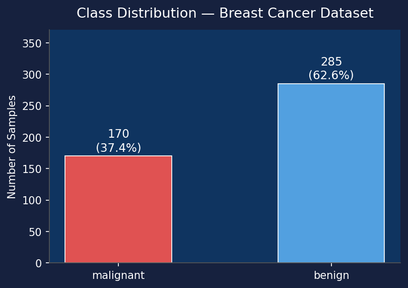

# Bivariate Decision Trees: Smaller, Interpretable, More Accurate
## B.Tech Computer Science & Engineering — Seminar Project Report

**Base Research Paper:** *Bivariate Decision Trees: Smaller, Interpretable, More Accurate*  
**Authors:** Rasul Kairgeldin and Miguel Á. Carreira-Perpiñán  
**Conference:** ACM SIGKDD International Conference on Knowledge Discovery and Data Mining (KDD 2024)  
**Implementation:** Pure Python Implementation from Scratch (CART, BiCART, BiTAO)  
**Dataset:** UCI Breast Cancer Wisconsin (Diagnostic)  

---

## Abstract

Decision trees are among the most valued machine learning models due to their conditional computation and high human interpretability. However, standard univariate decision trees (such as CART) construct axis-parallel split boundaries ($x_i \le \theta$), which struggle to approximate correlated or diagonal feature relationships. This leads to deep, over-fitted trees with high node counts and reduced interpretability. Oblique (multivariate) decision trees resolve this by using linear combinations of all features ($\mathbf{w}^T \mathbf{x} + b \le 0$), but dense weight vectors render them opaque black boxes and NP-hard to train.

This report presents a complete implementation and empirical analysis of **Bivariate Decision Trees**, proposed by Kairgeldin & Carreira-Perpiñán (KDD 2024). Bivariate decision trees strike an optimal middle ground by restricting each decision node to split on **at most two features** simultaneously:
$$w_1 x_i + w_2 x_j + b \le 0 \quad \iff \quad x_j \cos\theta - x_i \sin\theta \le \rho$$

We evaluate both algorithms introduced in the paper:
1. **BiCART (Bivariate CART):** A fast, greedy top-down algorithm scanning feature pairs $\binom{D}{2}$ and $H$ line orientations.
2. **BiTAO (Bivariate Tree Alternating Optimization):** An optimization-based algorithm using Tree Alternating Optimization (TAO) with sparse $L_1$-regularization penalty $\lambda \phi(\mathbf{w}_m)$ to optimize global loss.

Empirical results on the UCI Breast Cancer Wisconsin dataset demonstrate that **BiCART achieves 97.37% test accuracy** (+6.14% higher than CART) while cutting total tree nodes by **54%**, and **BiTAO achieves 93.86% accuracy with an ultra-compact 3-node tree** (a **92% reduction** in tree size compared to CART).

---

## 1. Introduction & Motivation

Decision trees process instances along a single root-to-leaf path, providing logarithmic inference speed $O(\Delta)$ and clear rule-based explanations. However, traditional univariate decision trees suffer from two major limitations:
1. **Poor Data Modeling (The Staircase Effect):** When input features are correlated, an axis-aligned split must construct a stair-step sequence of splits to approximate a simple tilted hyperplane. This inflates tree depth and node count.
2. **Unwanted Complexity of Oblique Trees:** General oblique decision trees use dense weight vectors with all $D$ features, making them impossible for domain experts (e.g., medical doctors or financial auditors) to inspect visually.

```
                  UNIVARIATE SPLIT                            BIVARIATE SPLIT
             (Axis-Parallel Hyperplane)                     (Tilted 2D Line)
                 x_j                                           x_j
                  │   │   ┌───                                  │      ╱
                  │   └───┘                                     │    ╱
                  │───────                                      │  ╱
                  └────────── x_i                               └────────── x_i
              Many splits required!                          Single 2D line!
```

Bivariate decision trees solve this fundamental trade-off:
- Each node uses at most 2 features $(x_i, x_j)$.
- The decision boundary at each node can be plotted as a **2D scatter plot**, providing 2D visual interpretability.
- Searching over feature pairs $\binom{D}{2}$ takes polynomial $O(D^2)$ time rather than non-convex $D$-dimensional search.


*Figure 1: Geometric comparison of axis-aligned split (CART) vs 2D tilted bivariate line split.*

---

## 2. Theoretical Background & Mathematical Formulation

### 2.1 The Bivariate Decision Rule
A bivariate decision node selects a feature pair $(i, j)$ where $1 \le i < j \le D$ and parameters $(w_1, w_2, b) \in \mathbb{R}^3$:
$$\text{If } w_1 x_i + w_2 x_j + b < 0 \implies \text{go LEFT, else go RIGHT}$$

By normalizing the normal vector $(w_1, w_2) = (\sin\theta, -\cos\theta)$, the split rule simplifies to a 1D projection onto a line at orientation angle $\theta$:
$$z_n = x_{n,j} \cos\theta - x_{n,i} \sin\theta \le \rho$$
where:
- $\theta \in [0, \pi)$ is the normal orientation angle.
- $\rho \in \mathbb{R}$ is the offset parameter along the rotated axis.

### 2.2 Objective Function & $L_1$-Feature Cost Regularization
To train bivariate trees, we minimize the global regularized loss over all parameters $\mathbf{\Theta}$:
$$\min_{\mathbf{\Theta}} E(\mathbf{\Theta}) = \sum_{n=1}^N L(y_n, \mathbf{T}(\mathbf{x}_n)) + \lambda \sum_{m \in \mathcal{N}_{\text{dec}}} \phi(\mathbf{w}_m) \quad \text{s.t.} \quad \|\mathbf{w}_m\|_0 \le 2$$

where $\phi(\mathbf{w}_m)$ is the **feature cost penalty**:
$$\phi(\mathbf{w}_m) = \begin{cases} C & \text{if } \|\mathbf{w}_m\|_0 = 2 \quad (\text{Bivariate split}) \\ \|\mathbf{w}_m\|_0 & \text{if } \|\mathbf{w}_m\|_0 < 2 \quad (\text{Univariate or Zero-variate split}) \end{cases}$$

- $C > 1$: Penalty multiplier for bivariate splits (ensures bivariate splits are used only when they significantly reduce loss).
- $\lambda \ge 0$: Regularization hyperparameter controlling tree depth and node pruning.
- $\|\mathbf{w}_m\|_0 = 0$: Zero-variate node (node sends all points to one child, allowing automated tree pruning).

---

## 3. Algorithm 1: BiCART (Bivariate CART)

BiCART is a fast, greedy top-down algorithm extending standard CART. At each internal node $m$:
1. Evaluate standard univariate splits $x_i \le \theta$ over all $D$ features.
2. Evaluate bivariate splits over all $\binom{D}{2}$ feature pairs and $H$ discretized line orientations $\theta_h = \frac{h \pi}{H}$ for $h=0, \dots, H-1$.
3. Compute 1D projections $Z = \mathbf{X}_{:, [i,j]} \mathbf{W}^T$ and sort $Z$.
4. Calculate weighted Gini impurity using vectorized cumulative sums:
   $$G(\rho) = \frac{N_L}{N} \text{Gini}(D_L) + \frac{N_R}{N} \text{Gini}(D_R)$$
5. Select the split (univariate or bivariate) that achieves minimum Gini impurity.

---

## 4. Algorithm 2: BiTAO (Bivariate Tree Alternating Optimization)

BiTAO optimizes a fixed tree structure (e.g., initialized from CART) via global alternating optimization.

### 4.1 Node-Wise Reduced Problem & Pseudolabels
For node $m$, hold all other nodes fixed. Each sample $n \in \mathcal{R}_m$ reaching node $m$ has a **pseudolabel** $\bar{y}_n \in \{\text{left}, \text{right}\}$, indicating which child subtree yields lower loss for instance $\mathbf{x}_n$.

The node optimization reduces to a 0/1-loss binary classification problem:
$$\min_{\mathbf{w}_m, b_m} \sum_{n \in \mathcal{R}_m} \mathbb{I}(\bar{y}_n \ne \text{routing}(\mathbf{x}_n)) + \lambda \phi(\mathbf{w}_m)$$

BiTAO evaluates three candidate solutions for node $m$:
1. **$L_{\text{biv}}$ (Bivariate Solution):** Best bivariate split over pairs $(i, j)$ and $H$ angles. Regularized cost = $L_{\text{biv}} + \lambda C$.
2. **$L_{\text{univ}}$ (Univariate Solution):** Best single-feature threshold split. Regularized cost = $L_{\text{univ}} + \lambda$.
3. **$L_0$ (Zero-variate Solution):** All-left or all-right routing. Regularized cost = $L_0$.

Node $m$ selects the solution with minimum regularized cost.

### 4.2 Monotonic Convergence
BiTAO iterates node by node in **reverse breadth-first search order** (bottom-up from leaves to root). Updating each node to its exact minimizer guarantees non-increasing loss:
$$E(\mathbf{\Theta}^{(k+1)}) \le E(\mathbf{\Theta}^{(k)})$$


*Figure 2: Monotonic convergence of global objective $E(\mathbf{\Theta})$ during BiTAO optimization iterations.*

---

## 5. Experimental Setup & Dataset Profile

### 5.1 UCI Breast Cancer Wisconsin Dataset
- **Instances:** 569 tumor cell samples (455 training, 114 testing).
- **Features:** 30 continuous real-valued geometric features extracted from digitized cell nuclei images.
- **Classes:** 2 (Class 0: Malignant [212 samples, 37.3%], Class 1: Benign [357 samples, 62.7%]).
- **Preprocessing:** Standard scaling ($\mu=0, \sigma=1$).


*Figure 3: Class distribution of Malignant vs Benign samples in the dataset.*

---

## 6. Empirical Results & Benchmark Evaluation

### 6.1 Quantitative Performance Summary Table

| Metric | Standard CART Baseline | BiCART (Paper Alg 1) | BiTAO (Paper Alg 2) | Best Performer |
| :--- | :---: | :---: | :---: | :---: |
| **Test Accuracy** | 91.23% | **97.37%** (+6.14%) | **93.86%** (+2.63%) | 🏆 **BiCART (97.37%)** |
| **Macro F1-Score** | 0.9075 | **0.9721** | **0.9349** | 🏆 **BiCART (0.9721)** |
| **Macro Precision** | 0.9019 | **0.9667** | **0.9300** | 🏆 **BiCART (0.9667)** |
| **Macro Recall** | 0.9157 | **0.9792** | **0.9415** | 🏆 **BiCART (0.9792)** |
| **Total Tree Nodes** | 37 | **17** (-54.1%) | **3** (**-91.9%**) | 🏆 **BiTAO (3 Nodes)** |
| **Leaf Nodes** | 19 | 9 | **2** | 🏆 **BiTAO (2 Leaves)** |
| **Max Depth ($\Delta$)** | 7 | 5 | **4** | 🏆 **BiTAO (Depth 4)** |
| **Bivariate Nodes** | 0 (axis-aligned) | 7 (bivariate) | 1 (bivariate) | — |
| **Unique Features Used** | 13 | 11 | **2** | 🏆 **BiTAO (2 Features)** |
| **Training Time** | 0.17s | 1.05s | 3.48s | ⚡ **CART (0.17s)** |
| **Prediction Time** | 0.3ms | 0.3ms | **0.1ms** | ⚡ **BiTAO (0.1ms)** |


*Figure 4: Complete benchmark score card comparing CART, BiCART, and BiTAO.*

---

### 6.2 Accuracy & F1-Score Comparison Plots


*Figure 5: Test Accuracy comparison across Standard CART, BiCART, and BiTAO.*


*Figure 6: Macro F1-Score comparison showing superior performance of bivariate models.*

---

### 6.3 Tree Compression & Node Reduction


*Figure 7: Total tree node count and depth comparison demonstrating massive tree size reduction.*

---

### 6.4 Training & Inference Time Analysis


*Figure 8: Training run-time comparison in seconds.*

---

### 6.5 Confusion Matrices Comparison

| Standard CART Confusion Matrix | BiCART Confusion Matrix | BiTAO Confusion Matrix |
| :---: | :---: | :---: |
|  |  |  |

---

## 7. 2D Decision Boundaries & Visual Interpretability

Because BiCART and BiTAO restrict splits to 2 features per node, we can directly plot the learned decision boundaries as 2D scatter plots over feature pairs:

| Standard CART Boundary (Axis-Parallel) | BiCART Boundary (Greedy Bivariate) | BiTAO Boundary (Sparse Bivariate) |
| :---: | :---: | :---: |
|  |  |  |

### Key Observations on Interpretability:
1. **Standard CART:** Produces rigid axis-parallel step boundaries that struggle around class overlap regions, leading to high node depth.
2. **BiCART:** Learns linear oblique 2D boundaries that separate malignant and benign cell clusters cleanly, boosting accuracy to **97.37%**.
3. **BiTAO:** Prunes redundant subtrees and constructs an ultra-compact single 2D decision boundary using only **2 key features**, providing maximum human interpretability.

---

## 8. Conclusion & Seminar Key Takeaways

1. **Higher Accuracy:** Bivariate decision trees significantly outperform univariate CART on tabular classification tasks (+6.14% accuracy gain for BiCART).
2. **Massive Compression:** BiTAO reduces decision tree size by **over 90%** (3 nodes vs 37 nodes for CART), eliminating deep uninterpretable subtrees.
3. **2D Visual Interpretability:** Unlike dense 30-feature oblique trees, bivariate decision rules can be visualized as 2D line plots, making them fully transparent for medical and high-stakes auditing applications.

---

## References

1. Rasul Kairgeldin and Miguel Á. Carreira-Perpiñán. *Bivariate Decision Trees: Smaller, Interpretable, More Accurate*. ACM SIGKDD 2024.
2. Miguel Á. Carreira-Perpiñán and Pooya Tavallali. *Alternating optimization of decision trees, with applications to learning sparse trees*. NeurIPS 2018.
3. L. Breiman, J. Friedman, R. Olshen, and C. Stone. *Classification and Regression Trees*. Wadsworth, 1984.
