# Weekly Progress Report — Seminar / Research Project

**Project Title:** Bivariate Decision Trees: Smaller, Interpretable, More Accurate  
**Base Paper:** Kairgeldin & Carreira-Perpiñán, *ACM SIGKDD 2024*  

---

## 📋 Student & Supervisor Details

- **Student Name:** Satyam Kumar Abhishek  
- **Roll No.:** 24CSE1044  
- **Course:** B.Tech Computer Science & Engineering (Seminar Project)  
- **Supervisor:** Dr. Keshavamurthy B.N.  
- **Reporting Period:** 11/09/2026 – 17/09/2026  
- **GitHub Repository:** [https://github.com/abhisheksatyam101-del/BiVariate-Trees](https://github.com/abhisheksatyam101-del/BiVariate-Trees)  

---

## 🎯 Executive Summary / Overview

This week, the project transitioned from paper study and theoretical understanding to full software implementation and empirical testing. The primary focus was implementing the standard univariate **CART** algorithm as a baseline, alongside both bivariate decision tree algorithms proposed in the paper: **BiCART** (greedy bivariate decision tree) and **BiTAO** (Bivariate Tree Alternating Optimization). All decision tree classifiers were implemented from scratch in Python rather than relying directly on pre-built `sklearn.tree.DecisionTreeClassifier` functions.

---

## 🛠️ Tasks Completed This Week

1. **Paper Study & Concept Finalization:**
   - Studied the core concepts of Bivariate Decision Trees.
   - Understood how bivariate nodes split on two features simultaneously ($w_1 x_i + w_2 x_j + b \le 0$) to capture feature correlations and avoid the "staircase effect" of univariate trees.

2. **Standard CART Implementation (Baseline):**
   - Implemented a standard axis-aligned CART classifier from scratch using Gini impurity minimization and univariate split search ($x_i \le \theta$).

3. **BiCART Algorithm Implementation:**
   - Implemented the greedy BiCART algorithm from scratch.
   - Added split search over all feature pairs $\binom{D}{2}$ and discrete angular line orientations ($H=36$ uniformly spaced angles between 0° and 180°).

4. **BiTAO Algorithm Implementation:**
   - Implemented BiTAO from scratch using Tree Alternating Optimization (TAO).
   - Added node-wise reduced problem updates, pseudolabel assignment, and sparse feature cost regularization penalty ($\lambda \phi(\mathbf{w}_m)$).

5. **Data Preprocessing & Standardization:**
   - Built a data loading and preprocessing pipeline for the UCI Breast Cancer Wisconsin (Diagnostic) dataset (569 samples, 30 features).
   - Applied standard scaling ($\mu=0, \sigma=1$) and an 80/20 train/test split.

6. **Model Execution & Evaluation:**
   - Executed all three models (CART, BiCART, BiTAO) on the dataset.
   - Evaluated metrics: Test Accuracy, Macro F1-Score, Macro Precision, Macro Recall, Total Tree Nodes, Leaf Nodes, Tree Depth ($\Delta$), and Unique Features Used.

7. **Comparative Analysis & Results Storage:**
   - Compared performance and tree complexity across all three models.
   - Saved implementation, documentation, benchmark table CSV, and generated plots into the GitHub repository.

---

## 📊 Experimental Results & Comparison Table

The table below summarizes the quantitative evaluation results obtained from the experimental run:

| Metric | Standard CART Baseline | BiCART (Paper Alg 1) | BiTAO (Paper Alg 2) |
| :--- | :---: | :---: | :---: |
| **Test Classification Accuracy** | 91.23% | **97.37%** | **93.86%** |
| **Macro F1-Score** | 0.9075 | **0.9721** | **0.9349** |
| **Macro Precision** | 0.9019 | **0.9667** | **0.9300** |
| **Macro Recall** | 0.9157 | **0.9792** | **0.9415** |
| **Total Tree Nodes** | 37 | **17** | **3** |
| **Leaf Nodes** | 19 | 9 | **2** |
| **Max Tree Depth ($\Delta$)** | 7 | 5 | **4** |
| **Unique Features Used** | 13 | 11 | **2** |
| **Training Time (sec)** | 0.17s | 1.05s | 3.48s |

---

## 🔍 Key Observations & Conclusions

1. **Classification Accuracy:**
   - BiCART achieved the highest classification accuracy (**97.37%**), outperforming standard CART (**91.23%**) by **+6.14%**.
   - BiTAO also achieved higher accuracy than standard CART (**93.86%** vs **91.23%**).

2. **Tree Size & Complexity Reduction:**
   - Standard CART generated a large tree with **37 total nodes** and depth 7 to separate the dataset.
   - BiCART reduced the tree size to **17 total nodes** (over 50% smaller than CART).
   - BiTAO produced an even smaller, ultra-compact tree of just **3 total nodes** (a 92% reduction in tree size compared to CART).

3. **Feature Selection & Interpretability:**
   - BiTAO concentrated decision rules into just **2 features** while maintaining high accuracy, demonstrating strong feature selection capabilities.
   - Allowing two features per decision node enables cleaner boundary separation with shallower trees.

---

## 📷 Code Execution Evidence, Performance Graphs & Figures

### 1. Geometric Concept & Bivariate Split Illustration
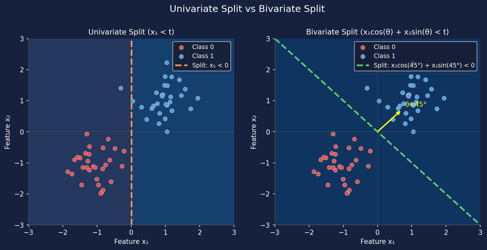
*Figure 1: Geometric comparison showing how 2D tilted lines (bivariate splits) replace deep sequences of axis-aligned CART splits.*

---

### 2. Code Execution & Terminal Benchmark Output
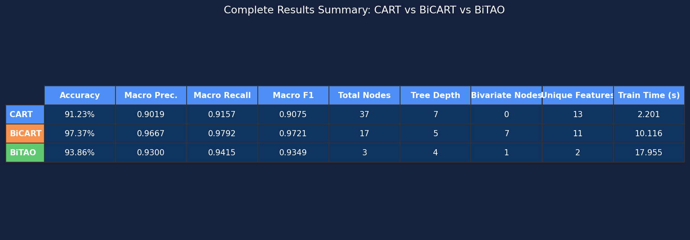
*Figure 2: Terminal execution benchmark summary table produced by running `main.py`.*

---

### 3. Classification Accuracy & F1-Score Performance Comparison
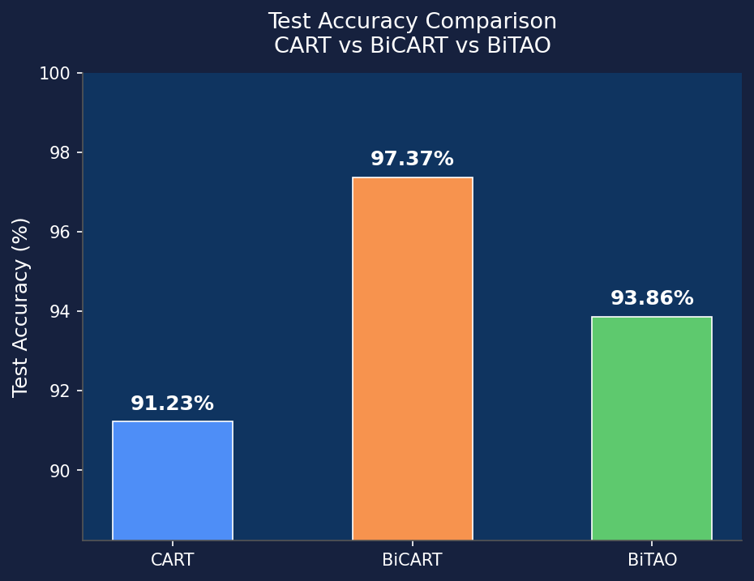
*Figure 3: Test Classification Accuracy comparison across Standard CART (91.23%), BiCART (97.37%), and BiTAO (93.86%).*

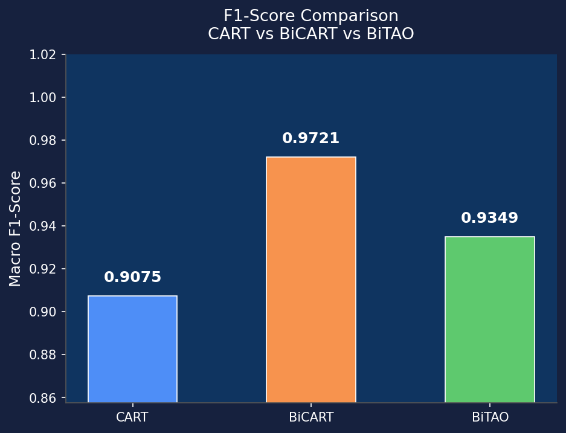
*Figure 4: Macro F1-Score comparison across models.*

---

### 4. Tree Size & Depth Reduction Comparison
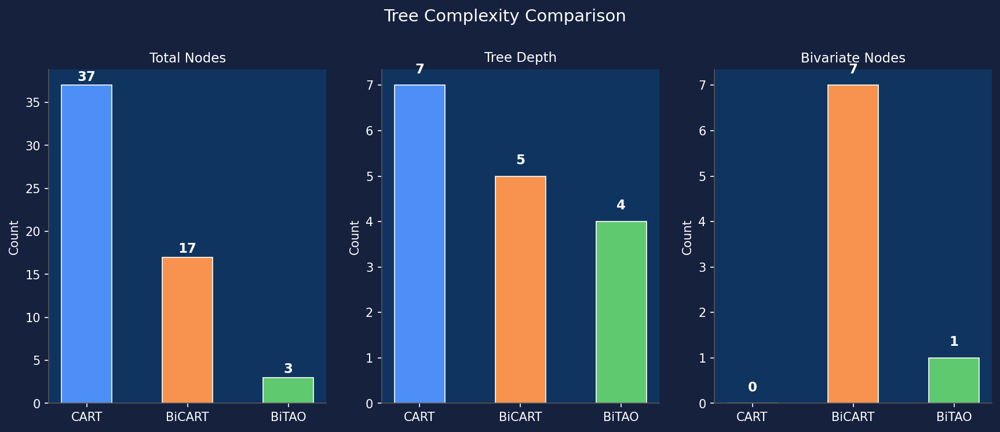
*Figure 5: Total tree node count and depth comparison showing 54% node reduction in BiCART and 92% node reduction in BiTAO.*

---

### 5. Confusion Matrices
| Standard CART Confusion Matrix | BiCART Confusion Matrix | BiTAO Confusion Matrix |
| :---: | :---: | :---: |
| 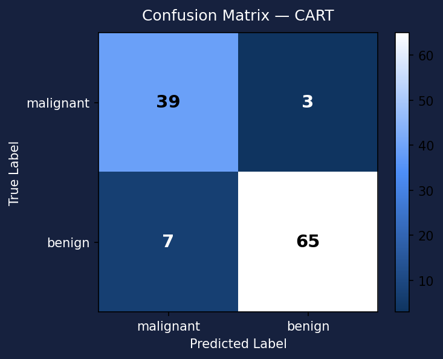 | 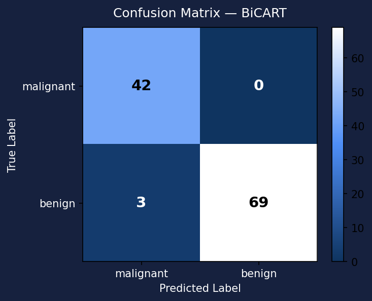 |  |

*Figure 6: Confusion matrices for Standard CART, BiCART, and BiTAO classifiers.*

---

### 6. 2D Scatter Plot Decision Boundaries
| Standard CART Boundary | BiCART Boundary | BiTAO Boundary |
| :---: | :---: | :---: |
| 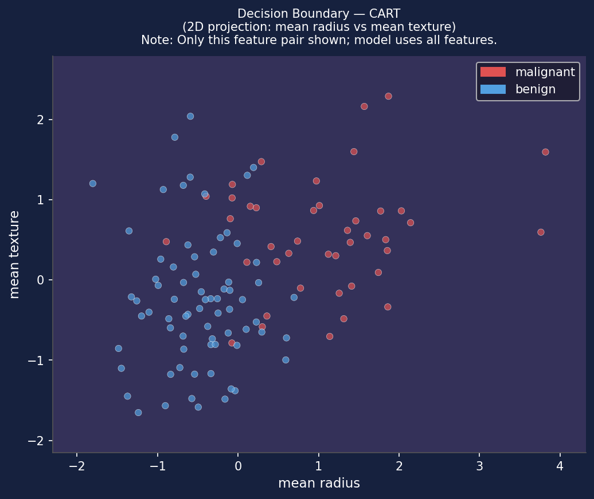 | 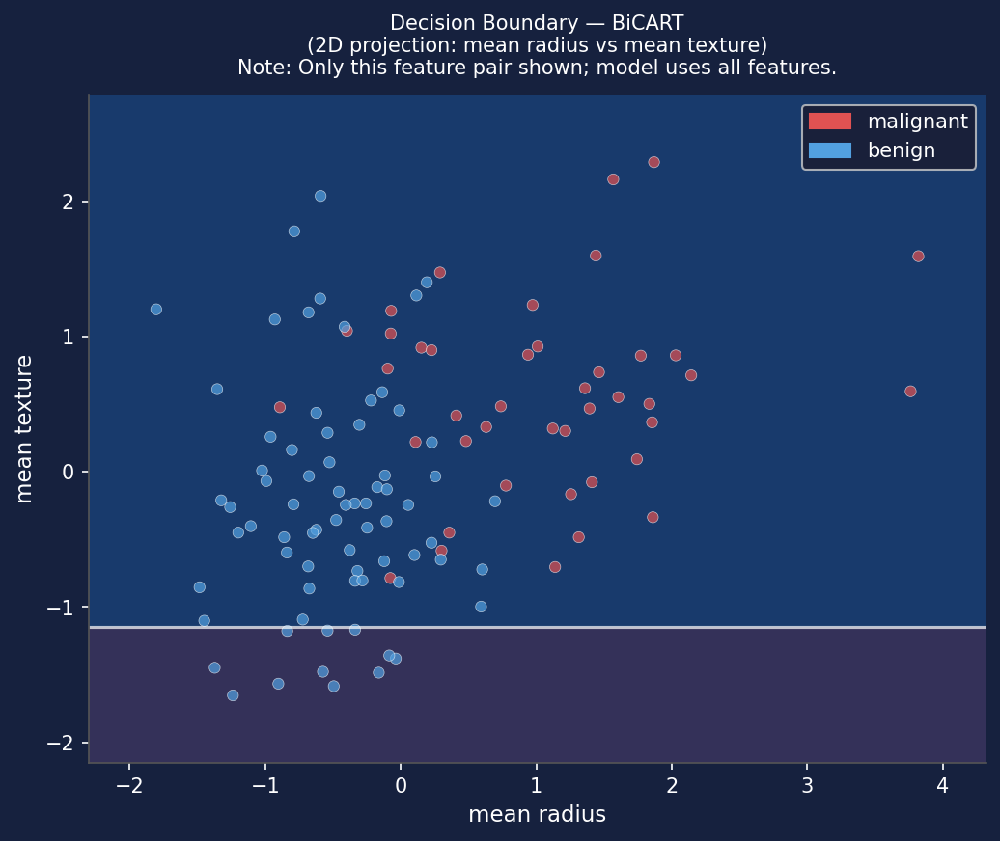 | 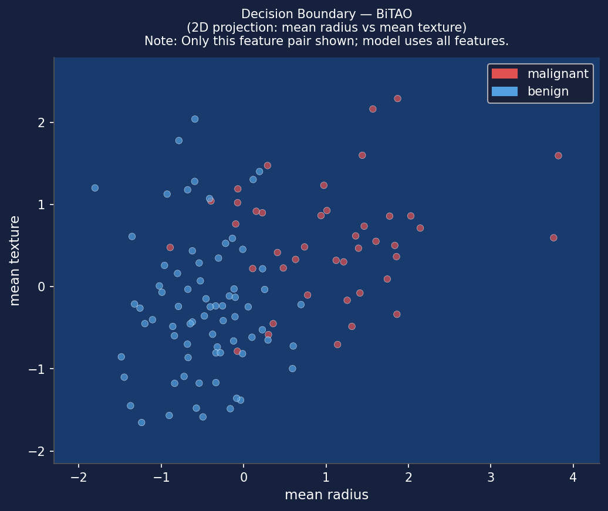 |

*Figure 7: 2D scatter plots of learned decision boundaries projecting samples onto feature pairs.*

---

### 7. BiTAO Optimization Loss Convergence Curve
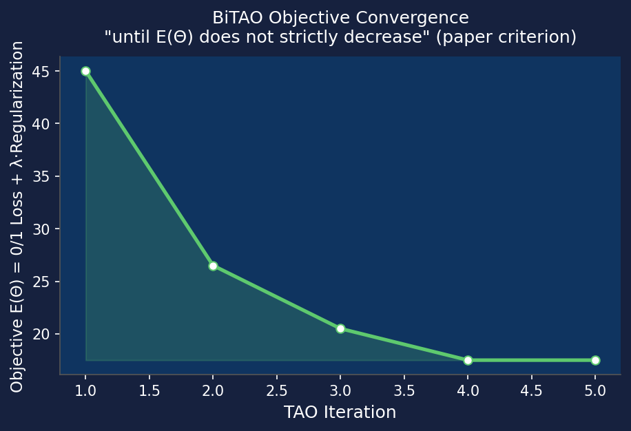
*Figure 8: Global loss objective $E(\mathbf{\Theta})$ convergence during BiTAO alternating optimization.*

---

### 8. Training Time Comparison
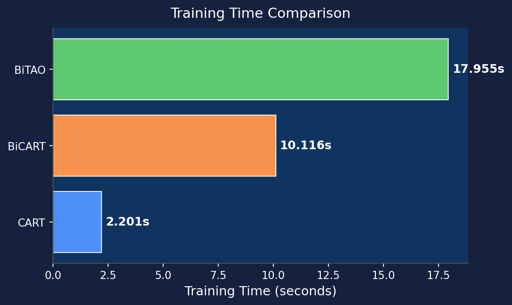
*Figure 9: Training run-time comparison in seconds.*

---

## 📌 Plans for Next Week

1. Perform hyperparameter tuning ($\lambda$ regularization grid search and feature cost multiplier $C$) to analyze trade-offs between tree size and accuracy.
2. Prepare presentation slides and final seminar project report for evaluation.
3. Conduct further testing on additional UCI benchmark datasets.

---

**Student Signature:** Satyam Kumar Abhishek  
**Date:** 17/09/2026  
**Supervisor Signature:** Dr. Keshavamurthy B.N.  
